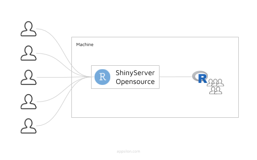
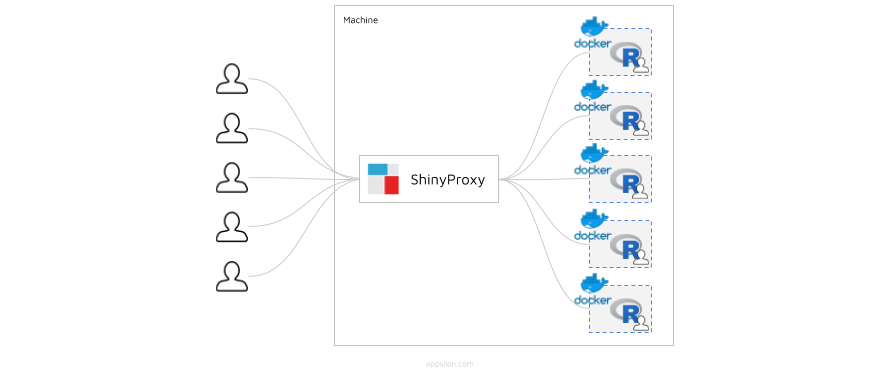
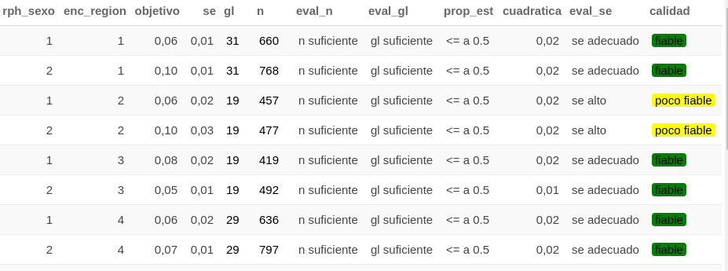

```{r setup, include=FALSE}
### para pasar a pdf

#  pagedown::chrome_print("/home/ricardo/Documents/INE/ENUSC/Curso_Survey_SPD/presentacion.html")
# pagedown::chrome_print("/home/ricardo/Documents/Sto Tomas/U. Santo Tomás/Productos/presentacion2/reporte3.Rmd")
# 
#### tutoruial xaringan https://slides.yihui.org/xaringan/#1
###3 tutorial rmarkdown https://rmarkdown.rstudio.com/authoring_pandoc_markdown.html#Lists
```

```{r xaringan-themer, include=FALSE, warning=FALSE, out.width  = 0.5, out.height = 0.5}
library(xaringanthemer)
library(tidyverse)
library(haven)
library(survey)


#db = read.csv("base-de-datos---xvi-enusc-2019.csv", header = T, sep = ";")

 style_mono_accent(
   base_color = "#1c89b3",
   header_font_google = google_font("lato"),
   text_font_google   = google_font("lato", "300", "300i"),
   code_font_google   = google_font("Fira Mono"),
  
 )

```

## Temario
1. Objetivos
1. Sobre Shiny
1. Soportes para Shiny
    1. Shiny Server (open source)
    1. ShinyProxy
1. Requerimientos
    1. Acceso servidor con clave SSH
    1. Necesidad de modificar archivos .conf (subida de archivos)
1. Estructura App.
1. Plazos
1. Recomendaciones para elaborar una Shiny App.
---
# Objetivos:
***.black[.center[Facilitar el acceso y utilización de las funcionalidades del paquete de "Calidad" desarrollado por el proyecto estratégico de Servicios Compartidos, para usuarios sin conocimiento de R, a traves del desarrollo de una aplicación web interactiva con el paquete Shiny de Rstudio.]]***

### Específicos
- Probar, evaluar y documentar diferentes tipos de soportes de la aplicación para usuarios internos (y externos). 

- Generar información sobre las mejores alternativas de soportes en torno a las necesidades de:  **.black[Seguridad]**, **.black[Autenticación de usuarios]** y **.black[Acceso para multiples usuarios]**

---
# Shiny
#### .center[Shiny es un paquete (framework) de Rstudio que permite construir aplicaciones web interactivas a partir de los scripts de R. La interactividad de estas aplicaciones permite manipular los datos sin tener que manipular el código.]

**.black[¿Por qué Shiny?]**

- Para crear aplicaciones web de código abierto de manera gratuita.
- Poco esfuerzo y grandes resultados.
- Puede ser desarrollado por usuarios de R. Literalmente, no necesitas un desarrollador frontend.
- Permite acceder a todo el potencial de análisis y procesamiento estadístico que posee R, sin necesidad de trabajar con el código.

**.black[En resumen, puede crear hermosas aplicaciones web interactivas directamente desde R.]**


---

class: center, middle

# Pero....¿Como se despliega?

---

# Shiny Server (open source)1

**.black[Pros:]**
- Aloja cada aplicación en su propia dirección web. 
- Inicia automáticamente la aplicación cuando un usuario visite la dirección.
- Autenticación poco segura.

**.black[Contras:]**
- Soporta un total de 20 usuarios conectados simultaneamente.
- Todos los usuarios se conectan con el mismo proceso.
- Shiny Server Pro cuesta $11.950 USD/año

La arquitectura de Shiny Server open source, se presenta en el siguiente esquema:
```{r echo = FALSE, out.width='60%', warning=FALSE, message=FALSE, fig.align='center'}
 
```

---

## ShinyProxy 
**.black[Pros:]**    ***.black[Basado en docker]***
- Permite la autenticación y autorización con LDAP, facilita el tráfico (sobre TLS).
- No tiene límites de usuarios en una aplicación.
- Para cada usuario, inicia un contenedor con aplicación.
- Se puede configurar para detener el contenedor cuando no esté en uso.
- Puede alojar aplicaciones web desarrolladas por Python (Dash).

**.black[Contras:]**
- Cada usuario que inicializa un contenedor, puede consumir la RAM del servidor.
- El usuario debe esperar hasta que se inicialice el contenedor.
- Requiere esfuerzo configurar la plataforma.

La arquitectura de ShinyProxy se puede observar en el siguiente diagrama:

```{r echo = FALSE, out.width='60%', warning=FALSE, message=FALSE, fig.align='center'}
 
```

---

# Requerimiento

  1. Acceso servidor con clave SSH
  1. Necesidad de modificar archivos .conf (subida de archivos)
  1. Necesidad de modificar permisos de usuarios a uso y acceso de archivos (ej: descargables)
  1. Apoyo, en configuación del servidor? en docker?

---
# Plazos?


---
## ¿Como elaborar una Shiny App?
### Herramientas básicas:
+ Github
+ Trabajar con módulos
+ Realizar testeos

### Definiciones generales y Elaborar estrategia
#### Definición usuarios ¿Que tipos de usuarios se tiene?
¿Cuantos usuarios son?
+ 10, 20, 30 ?

¿Cuantos tipos de usuarios son?
+ Usuario INE, entra valida una tabla y se va? le interesará validar muchas tablas?
+ Usuario externo?.

---

# Discusión estructura App

1. **.black[UI]**
    1. **Inputs Usuario**
        1. Parametros DC: a) UPM, b) Estrato, c) FE, d) Dataset
        1. Desagregación (dominios): Variables de cruce
        1. Tipo de cálculo: Medias, Totales, Totales_continuas, Proporciones
        1. Variable o variables objetivo: "PET" "Ingreso Hogares" "Victimización"
              + ¿ Puede elegir mas de una variable ?  para generar mas de una tabla? o una tabla con muchas variables?
        1. **Subopoblaciones?** (¿Como la ENE calcula in dindicador con paquete "calidad")
    1. **Outputs**
        1. Visualización tablas
        1. **¿Visualización evaluación calidad tabla en relación al estandar?**
        1. Exportación (bases y tabulados).
        1. **Tipo de tablas?**
            - Tabulados html
            - Tabulados
            - Tablas (estilo dataframe) (definir estilos de tabulados)

---
## Tabulado HTML Calidad
#### ¿Es definitivo? o ¿el usuario deberá generar su propio tabulado y luego comparar con este?

```{r echo = FALSE, out.width='60%', warning=FALSE, message=FALSE, fig.align='center'}
 
```

### Tabulado tipo ENUSC

### Tabulado tipo ENE

---

# Discusión estructura App

1. **.black[Server]**
    1. Recepción inputs
        1. Recibir parametros
        1. Recibir desagergación
        1. Recibir Tipo de cálculo
        1. Variable o variables objetivo
    1. Declaración diseño complejo
    1. Aplicación paquete "Calidad"
    1. **¿Iteración sobre otras posibles variables?**
    1. Generación de tabulados
    1. **Generación de evaluación de tabulados?**
    1. **Generación de output descargable?**

---
class: center, middle

# GRACIAS!

---